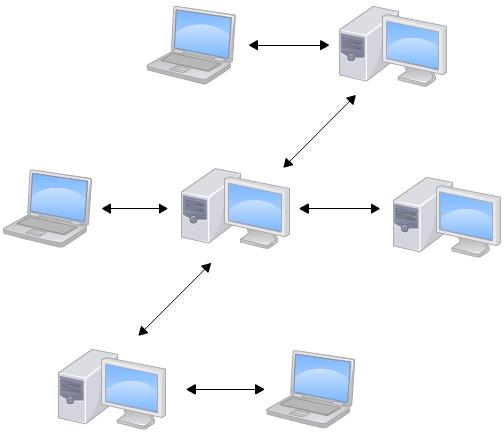

# Git简介

## Git的概念

Git是目前世界上最先进的分布式版本控制系统，使用C语言开发。

## 版本控制系统


概念：版本控制最主要的功能是追踪文件的变更，记录每次文件的改动。

### 版本控制系统分类

分为集中式和分布式，其中CVS、SVN为集中式的版本控制系统，Git为分布式版本控制系统。

####  集中式版本控制系统

集中式版本控制系统，版本库是集中存放在中央服务器的，而干活的时候，用的都是自己的电脑，所以要先从中央服务器取得最新的版本，然后开始干活，干完活了，再把自己的活推送给中央服务器。中央服务器就好比是一个图书馆，你要改一本书，必须先从图书馆借出来，然后回到家自己改，改完了，再放回图书馆。


####  分布式版本控制系统

分布式版本控制系统根本没有“中央服务器”，每个人的电脑上都是一个完整的版本库，这样，你工作的时候，就不需要联网了，因为版本库就在你自己的电脑上。既然每个人电脑上都有一个完整的版本库，那多个人如何协作呢？比方说你在自己电脑上改了文件A，你的同事也在他的电脑上改了文件A，这时，你们俩之间只需把各自的修改推送给对方，就可以互相看到对方的修改了。
和集中式版本控制系统相比，分布式版本控制系统的安全性要高很多，因为每个人电脑里都有完整的版本库，某一个人的电脑坏掉了不要紧，随便从其他人那里复制一个就可以了。而集中式版本控制系统的中央服务器要是出了问题，所有人都没法干活了。
在实际使用分布式版本控制系统的时候，其实很少在两人之间的电脑上推送版本库的修改，因为可能你们俩不在一个局域网内，两台电脑互相访问不了，也可能今天你的同事病了，他的电脑压根没有开机。因此，分布式版本控制系统通常也有一台充当“中央服务器”的电脑，但这个服务器的作用仅仅是用来方便交换“大家的修改，没有它大家也一样干活，只是交换修改不方便而已。



### 集中式VS分布式的区别

| 区别     | 集中式                             | 分布式                                                   |
| -------- | ---------------------------------- | -------------------------------------------------------- |
| 版本库   | 存放在中央服务器                   | 没有“中央服务器”                                         |
| 联网     | 必须联网（最大的毛病）             | 不需要联网                                               |
| 安全性   | 中央服务器出问题，所有人都没法干活 | 某一个人的电脑坏掉了不要紧，随便从其他人哪里复制一个即可 |
| 分支管理 | 分支功能不够强大                   | 极其强大的分支管理                                       |
| 暂存区   | 无                                 | 有                                                       |

## Git流程图解


# 基本使用

## 快速入门

### 创建仓库(repository)

1. 创建一个空目录；

   ```bash
   $ mkdir learngit # 创建目录learngit
   $ cd learngit # 进入文件夹learngit
   $ pwd # 显示当前目录。
   /e/GitTest
   ```

2. 使用`git init`命令把这个目录变成`Git`可以管理的仓库；

   ```bash
   $ git init
   Initialized empty Git repository in E:/GitTest/.git/
   # 创建好空仓库后，当前目录下多了.git的目录，该目录为Git来跟踪管理版本库的。
   ```

3. 新建文件`readme.txt`。

   ```bash
   # 文件内容
   Git is a version control system.
   Git is free software.
   ```

> 仓库建立后，我们对文件的新增、修改操作是在工作区。

###  添加文件到暂存区

1. 从工作区添加单个文件到暂存区

   ```bash
   $ git add readme.txt
   ```

2. 从工作区添加多个文件到暂存区

   ```bash
   $ git add readme.txt readme2.txt
   ```

3. 从工作区添加所有文件到暂存区

   ```bash
   $ git add --all
   ```

###  提交到版本库

把暂存区的文件提交到版本库。

```bash
$ git commit -m "wrote a readme file"
[master (root-commit) eaadf4e] wrote a readme file
 1 file changed, 2 insertions(+)
 create mode 100644 readme.txt
# -m 后面输入的是本次提交的说明，可以输入任意内容
```

## 管理修改

### 修改文件

当修改了`readme.txt`文件时。

```bash
# 修改内容，新增单词distributed
Git is a distributed version control system.
Git is free software
```

### 查看仓库状态

运行`git status`查看仓库当前的状态

```bash
   $ git status
   On branch master
   Changes not staged for commit:
     (use "git add <file>..." to update what will be committed)
     (use "git restore <file>..." to discard changes in working directory)
           modified:   readme.txt
   
   no changes added to commit (use "git add" and/or "git commit -a")
```

### 查看修改内容

当不清楚修改的内容时，运行`git diff`查看具体修改了什么内容

```bash
$ git diff
diff --git a/readme.txt b/readme.txt
index d8036c1..013b5bc 100644
--- a/readme.txt
+++ b/readme.txt
@@ -1,2 +1,2 @@
-Git is a version control system.
+Git is a distributed version control system.
 Git is free software.
\ No newline at end of file
```

### 添加文件到暂存区

把被修改的文件从工作区添加到暂存区，运行`git add`；

```bash
$ git add readme.txt
```

### 提交文件到版本库

把暂存区的文件提交到版本库，运行`git commit -m "add distributed"`；

```bash
$ git commit -m "add distributed"
[master b622eeb] add distributed
 1 file changed, 1 insertion(+), 1 deletion(-)
```

### 确认仓库状态

运行`git status`查看仓库当前的状态

```bash
$ git status
On branch master
nothing to commit, working tree clean
```

##  撤销修改

###  撤销工作区的修改

命令`git checkout -- readme.txt`意思就是，把`readme.txt`文件在工作区的修改全部撤销，这里有两种情况：

1. `readme.txt`自修改后还没有被添加暂存区，现在撤销修改就扔掉了当前工作区的内容，回到上一次提交到版本库的状态；
2. `readme.txt`已经添加到暂存区，但未提交到版本库，又在工作区作了修改，现在撤销修改就扔掉了当前工作区的内容，回到添加到暂存区时的状态。

> 总之，就是让这个文件在工作区的修改被抛弃，回到最近一次`git commit`或`git add`时的状态。

使用`git checkout --file`撤销修改回到上一次的添加（add）或提交（commit）的状态。

```shell
$ git checkout --readme.txt
```

### 放弃所有工作区的修改

```shell
$ git checkout .
```

该命令会删掉工作区所有的修改。

###  撤销暂存区的修改

1. 发现添加内容有错误，已添加（add）到暂存区，还未进行提交（commit）到版本库。

2. 用命令`git reset HEAD <file>`可以把暂存区的修改撤销掉（unstage），重新放回工作区。

   ```shell
   $ git reset HEAD readme.txt
   # git reset命令既可以回退版本，也可以把暂存区的修改回退到工作区。当我们用HEAD时，表示最新的版本
   Unstaged changes after reset:
   M	readme.txt
   ```

3. 使用`git status`查看一下，现在暂存区是干净的，工作区有修改。

   ```shell
   $ git status
   On branch master
   Changes not staged for commit:
     (use "git add <file>..." to update what will be committed)
     (use "git checkout -- <file>..." to discard changes in working directory)
   
   	modified:   readme.txt
   ```

4. 使用`git checkout --file`丢弃工作区的修改。

   ```shell
   $ git checkout -- readme.txt
   
   $ git status
   On branch master
   nothing to commit, working tree clean
   ```

### 撤销版本库的修改

1. 发现添加内容有错误，已添加（add）并提交（commit）到版本库。

2. 使用命令`git reset --hard HEAD^ `回到上一个版本即可。

   ```bash
   git reset --hard HEAD^ 
   ```

## 删除文件

需要删除某文件，可以直接使用命令`rm file`删除或在资源管理器中删除。

```shell
rm test.txt
```

使用`git status`查看状态，可以看到`test.txt`文件被删除了，现在分两种情况，确实需要删除和错误删除。

```shell
$ git status
On branch master
Changes not staged for commit:
  (use "git add/rm <file>..." to update what will be committed)
  (use "git checkout -- <file>..." to discard changes in working directory)

	deleted:    test.txt

no changes added to commit (use "git add" and/or "git commit -a")
```

1. 确实需要删除

   那就用命令`git rm`删掉，并且`git commit`。

   ```bash
      $ git rm test.txt
      rm 'test.txt'
      
      $ git commit -m "remove test.txt"
      [master d46f35e] remove test.txt
       1 file changed, 1 deletion(-)
       delete mode 100644 test.txt
   ```

   

2. 删除错误

     因为版本库里还有该文件，使用`git checkout -- test.txt`命令撤销工作区的修改，可以很轻松地把误删的文件恢复，回到上次提交的版本。

     ```shell
     $ git checkout -- test.txt
     # git checkout其实是用版本库里的版本替换工作区的版本，无论工作区是修改还是删除，都可以“一键还原”
     ```

# 时光机穿梭

## 版本回退

### 版本的概念

每次修改文件后，`commit`一次，称为一个新版本。

```bash
$ git commit -m "add distributed"
[master b622eeb] add distributed # b622eeb为版本号
 1 file changed, 1 insertion(+), 1 deletion(-)
```

### 回退到过去的版本

当前版本提交的内容错误，需要回到上一个版本。

1. 通过`git log`查看历史记录，可加上`--pretty=oneline`参数减少信息，使输出信息为一行，前面的`b622ee...`为版本号；

   ```bash
   $ git log --pretty=oneline # 使输出信息为一行
   b622eebed1ea48b4adfa329e690edc5918ceb553 (HEAD -> master) add distributed
   65d3c6e47f76bc9475c3b841ca44fed1d2752a3c renamed and deleted some files
   e786283270d3ae4489fba874f755d6d7ebde70e4 add more files
   61f336fd68ff39bcd1da26324c755f71a65ccb72 wrote a readme file
   ```
   
2. 使用`git reset`进行回退。其中上一个版本为`HEAD^`，上上一个版本为`HEAD^^`，更多的可以写为`HEAD~100`。

   ```bash
   # 写法1
   $ git reset --hard HEAD^ # 回退到 renamed and deleted some files 
   HEAD is now at 65d3c6e renamed and deleted some files
   # 写法2
   $ git reset --hard HEAD~1 # 回退到 renamed and deleted some files 
   HEAD is now at 65d3c6e renamed and deleted some files
   # 写法3
   $ git reset --hard 65d3c 
   # 回退到 renamed and deleted some files ，版本号不用输入全部，但不要太短，避免冲突
   HEAD is now at 65d3c6e renamed and deleted some files
   ```

3. 使用`git log`查看版本信息

   ```bash
   $ git log --pretty=oneline
   65d3c6e47f76bc9475c3b841ca44fed1d2752a3c (HEAD -> master) renamed and deleted some files
   e786283270d3ae4489fba874f755d6d7ebde70e4 add more files
   61f336fd68ff39bcd1da26324c755f71a65ccb72 wrote a readme file
   ```

### 回到未来的版本

因为一些原因，我现在非常后悔，需要回到最初的`add distributed`的版本。

1. 使用`git reflog`命令，查看使用过的每一次命令。

   ```bash
   $ git reflog
   65d3c6e (HEAD -> master) HEAD@{0}: reset: moving to HEAD^
   b622eeb HEAD@{1}: commit: add distributed # add distributed 的版本
   65d3c6e (HEAD -> master) HEAD@{2}: commit: renamed and deleted some files
   e786283 HEAD@{3}: commit: add more files
   61f336f HEAD@{4}: commit (initial): wrote a readme file
   ```

2. 找到`add distributed`的版本号，然后使用`git reset --hard b622e`回到`add distributed`的版本

   ```bash
   $ git reset --hard b622e
   HEAD is now at b622eeb add distributed
   ```

3. 使用`git log`查看版本信息

   ```bash
   $ git log --pretty=oneline
   b622eebed1ea48b4adfa329e690edc5918ceb553 (HEAD -> master) add distributed
   65d3c6e47f76bc9475c3b841ca44fed1d2752a3c renamed and deleted some files
   e786283270d3ae4489fba874f755d6d7ebde70e4 add more files
   61f336fd68ff39bcd1da26324c755f71a65ccb72 wrote a readme file
   ```

### 深入理解版本回退

Git的版本回退速度非常快，因为Git在内部有个指向当前版本的`HEAD`指针，当你回退版本的时候，Git仅仅是改变了指针的指向。

1. 版本回退前

    ```ascii
    ┌────┐
    │HEAD│
    └────┘
       │
       └──> ○ append GPL
            │
            ○ add distributed
            │
            ○ wrote a readme file
    ```

2. 版本回退后

    ```ascii
    ┌────┐
    │HEAD│
    └────┘
       │
       │    ○ append GPL
       │    │
       └──> ○ add distributed
            │
            ○ wrote a readme file
    ```

# 远程仓库

## 准备工作

这里使用github作为免费的远程仓库。由于本地Git仓库和GitHub仓库之间的传输是通过SSH加密的，所以需要一些设置。

1. 创建SSH Key。

   ```shell
   ssh-keygen -t rsa -C "youremail@example.com"
   # 邮箱改为自己的邮件地址，后面一路回车就好了
   ```

   然后在用户主目录下查找.ssh目录，里面有`id_rsa`和`id_rsa.pub`两个文件，这两个就是SSH Key的秘钥对，`id_rsa`是私钥，不能泄露出去，`id_rsa.pub`是公钥，可以放心地告诉任何人。

2. 登录GitHub，打开"Accout settings"，"SSH Keys"页面，点击"Add SSH Key"，填上任意Title，在Key文本框里粘贴`id_rsa.pub`文件的内容。

> 为什么GitHub需要SSH Key呢？因为GitHub需要识别出你推送的提交确实是你推送的，而不是别人冒充的，而Git支持SSH协议，所以，GitHub只要知道了你的公钥，就可以确认只有你自己才能推送。
>
> 当然，GitHub允许你添加多个Key。假定你有若干电脑，你一会儿在公司提交，一会儿在家里提交，只要把每台电脑的Key都添加到GitHub，就可以在每台电脑上往GitHub推送了。

## 添加远程库 

1. 登录GitHub，然后在右上角找到"Create a new repo"按钮，创建一个新的仓库。

2. 在Repository name填入`learngit`，其他保持默认设置，点击“Create repository”按钮，就成功地创建了一个新的Git仓库。

3. 根据GitHub的提示，在本地的`learngit`仓库下运行命令。

   ```shell
   $ git remote add origin git@github.com:hekun97/learngit.git
   # 其中hekun97为GitHub的账户名
   ```

4. 把本地内容推送到远程库上，`origin`为远程仓库名。

   ```shell
   $ git push -u origin master
   # 由于远程库是空的，第一次推送需加上-u
   Counting objects: 20, done.
   Delta compression using up to 4 threads.
   Compressing objects: 100% (15/15), done.
   Writing objects: 100% (20/20), 1.64 KiB | 560.00 KiB/s, done.
   Total 20 (delta 5), reused 0 (delta 0)
   remote: Resolving deltas: 100% (5/5), done.
   To github.com:michaelliao/learngit.git
    * [new branch]      master -> master
   Branch 'master' set up to track remote branch 'master' from 'origin'.
   ```

## 从远程库克隆

使用命令`git clone`克隆。

1. ssh协议

   ```bash
   $ git clone git@github.com:hekun97/learngit.git # ssh协议
   ```

2. https协议

   ```bash
   https://github.com/hekun97/learngit.git # https协议
   ```

## 删除远程库

如果添加的时候地址写错了，或者就是想删除远程库，可以用`git remote rm <name>`命令。使用前，建议先用`git remote -v`查看远程库信息：

```bash
$ git remote -v
origin  git@github.com:michaelliao/learn-git.git (fetch)
origin  git@github.com:michaelliao/learn-git.git (push)
```

然后，根据名字删除，比如删除`origin`：

```bash
$ git remote rm origin
```

此处的“删除”其实是解除了本地和远程的绑定关系，并不是物理上删除了远程库。远程库本身并没有任何改动。要真正删除远程库，需要登录到GitHub，在后台页面找到删除按钮再删除。

# 分支管理

分支就是在主分支上创建一个属于你自己的分支，别人看不到，但我能继续工作，想提交就提交，完成之后直接合并到主分支就行。

## 创建与合并分支

1. 创建`dev`分支，然后切换到`dev`分支。

   ```shell
   $ git switch -c dev
   Switched to a new branch 'dev'
   ```

   `git switch`命令加上`-c`参数表示创建并切换，相当于以下两条命令：

   ```shell
   $ git branch dev
   $ git switch dev
   Switched to branch 'dev'
   ```

2. 用`git branch`命令查看版本库。

   ```shell
   $ git branch
   * dev
     master
   ```

3. 然后在新的分支上就可以进行新功能的开发，并添加（add）和提交（commit）修改。

4. 完成新功能后，切换到主分支。

   ```shell
   $ git switch master
   Switched to branch &#39;master&#39;55
   ```

5. 把`dev`分支的工作成果合并到`master`分支上。

   ```shell
   $ git merge dev
   Updating d46f35e..b17d20e
   Fast-forward # Git告诉我们，这次合并是“快进模式”，也就是直接把master指向dev的当前提交
    readme.txt | 1 +
    1 file changed, 1 insertion(+)
   ```

6. 删除`dev`分支。

   ```shell
   $ git branch -d dev
   Deleted branch dev (was b17d20e).
   ```

> 还可以使用`git checkout -b <branch>`来创建并切换分支，`git checkout <branch>`切换分支，而前面讲过的撤销修改则是`git checkout -- <file>`，同一个命令，有两种作用。所以此处只使用`switch`，`checkout`仅做了解。

## 解决冲突

人生不如意之事十之八九，合并分支往往也不是一帆风顺的。

准备新的`feature1`分支，继续我们的新分支开发：

```
$ git switch -c feature1
Switched to a new branch 'feature1'
```

修改`readme.txt`最后一行，改为：

```
Creating a new branch is quick AND simple.
```

在`feature1`分支上提交：

```
$ git add readme.txt

$ git commit -m "AND simple"
[feature1 14096d0] AND simple
 1 file changed, 1 insertion(+), 1 deletion(-)
```

切换到`master`分支：

```
$ git switch master
Switched to branch 'master'
Your branch is ahead of 'origin/master' by 1 commit.
  (use "git push" to publish your local commits)
```

Git还会自动提示我们当前`master`分支比远程的`master`分支要超前1个提交。

在`master`分支上把`readme.txt`文件的最后一行改为：

```
Creating a new branch is quick & simple.
```

提交：

```
$ git add readme.txt 
$ git commit -m "& simple"
[master 5dc6824] & simple
 1 file changed, 1 insertion(+), 1 deletion(-)
```

现在，`master`分支和`feature1`分支各自都分别有新的提交，变成了这样：


这种情况下，Git无法执行“快速合并”，只能试图把各自的修改合并起来，但这种合并就可能会有冲突，我们试试看：

```
$ git merge feature1
Auto-merging readme.txt
CONFLICT (content): Merge conflict in readme.txt
Automatic merge failed; fix conflicts and then commit the result.
```

果然冲突了！Git告诉我们，`readme.txt`文件存在冲突，必须手动解决冲突后再提交。`git status`也可以告诉我们冲突的文件：

```
$ git status
On branch master
Your branch is ahead of 'origin/master' by 2 commits.
  (use "git push" to publish your local commits)

You have unmerged paths.
  (fix conflicts and run "git commit")
  (use "git merge --abort" to abort the merge)

Unmerged paths:
  (use "git add <file>..." to mark resolution)

	both modified:   readme.txt

no changes added to commit (use "git add" and/or "git commit -a")
```

我们可以直接查看readme.txt的内容：

```
Git is a distributed version control system.
Git is free software distributed under the GPL.
Git has a mutable index called stage.
Git tracks changes of files.
<<<<<<< HEAD
Creating a new branch is quick & simple.
=======
Creating a new branch is quick AND simple.
>>>>>>> feature1
```

Git用`<<<<<<<`，`=======`，`>>>>>>>`标记出不同分支的内容，我们修改如下后保存：

```
Creating a new branch is quick and simple.
```

再提交：

```
$ git add readme.txt 
$ git commit -m "conflict fixed"
[master cf810e4] conflict fixed
```

现在，`master`分支和`feature1`分支变成了下图所示：


用带参数的`git log`也可以看到分支的合并情况：

```
$ git log --graph --pretty=oneline --abbrev-commit
*   cf810e4 (HEAD -> master) conflict fixed
|\  
| * 14096d0 (feature1) AND simple
* | 5dc6824 & simple
|/  
* b17d20e branch test
* d46f35e (origin/master) remove test.txt
* b84166e add test.txt
* 519219b git tracks changes
* e43a48b understand how stage works
* 1094adb append GPL
* e475afc add distributed
* eaadf4e wrote a readme file
```

最后，删除`feature1`分支：

```
$ git branch -d feature1
Deleted branch feature1 (was 14096d0).
```

工作完成。

> 当Git无法自动合并分支时，就必须首先解决冲突。解决冲突后，再提交，合并完成。
>
> 解决冲突就是把Git合并失败的文件手动编辑为我们希望的内容，再提交。
>
> 用`git log --graph`命令可以看到分支合并图。

## 分支管理策略

通常，合并分支时，如果可以，Git会用`Fast forward`模式，但这种模式下，删除分支后，会丢掉分支信息。

如果要强制禁用`Fast forward`模式，Git会在merge时生成一个新的commit，这样，从分支历史上就可以看出分支信息。

### 保留分支信息

强制禁用`Fast forward`模式，保留分支信息。

1. 创建并切换`dev`分支。

   ```shell
   $ git switch -c dev
   Switched to a new branch 'dev'
   ```

2. 修改`readme.txt`文件，并提交一个新的`commit`。

   ```shell
   $ git add readme.txt 
   $ git commit -m "add merge"
   [dev f52c633] add merge
    1 file changed, 1 insertion(+)
   ```

3. 切换到主分支`master`。

   ```shell
   $ git switch master
   Switched to branch 'master'
   ```

4. 合并`dev`分支，请注意添加`--no-ff`参数，表示禁用`Fast forward`。

   ```shell
   $ git merge --no-ff -m "merge with no-ff" dev
   # 因为本次合并要创建一个新的commit，所以加上-m 参数，把commit描述写进去。
   Merge made by the 'recursive' strategy.
    readme.txt | 1 +
    1 file changed, 1 insertion(+)
   ```

5. 使用`git log`查看分支历史。

   ```shell
   $ git log --graph --pretty=oneline --abbrev-commit
   *   e1e9c68 (HEAD -> master) merge with no-ff
   |\  
   | * f52c633 (dev) add merge
   |/  
   *   cf810e4 conflict fixed
   ...
   ```

   分支历史如下图所示。

   

### 分支管理原则

在实际开发中，我们应该按照几个基本原则进行分支管理：

1. `master`分支应该是非常稳定的，也就是仅用来发布新版本，平时不能在上面干活；
2. 大家干活都在`dev`分支上，也就是说，`dev`分支是不稳定的，到某个时候，比如1.0版本发布时，再把`dev`分支合并到`master`上，在`master`分支发布1.0版本；
3. 具体的每个人都有自己的分支，在自己的分支上干完活，时不时地往`dev`分支上合并就可以了。

所以，团队合作的分支看起来就像这样。


### 强制删除分支

添加一个新功能时，你肯定不希望因为一些实验性质的代码，把主分支搞乱了，所以，每添加一个新功能，最好新建一个feature分支，在上面开发，完成后，合并，最后，删除该feature分支。

当我们在feature-need分支中完成开发后，因为一些原因需要放弃该分支，使用`git branch -d feature-need`命令删除会报错，删除失败。

```bash
$ git branch -d feature-need
error: The branch 'feature-need' is not fully merged.
If you are sure you want to delete it, run 'git branch -D feature-need'.
```

这时候你也看见了Git的提示信息，强制删除该分支需要使用`git branch -D feature-need`命令。

```
$ git branch -D feature-need
Deleted branch feature-vulcan (was 287773e).
```


## bug分支

###   “储藏”工作现场

修复bug时，我们会通过创建新的bug分支进行修复，然后合并，最后删除；

当手头工作没有完成时，需要先把工作现场“储藏”一下，然后去修复bug，修复后，再把“储藏”的工作现场恢复出来继续工作。

1. 查看当前工作区状态，存在未提交的文件；

   ```bash
   $ git status
   On branch dev
   Changes to be committed:
     (use "git reset HEAD <file>..." to unstage)
   
   	new file:   hello.py
   
   Changes not staged for commit:
     (use "git add <file>..." to update what will be committed)
     (use "git checkout -- <file>..." to discard changes in working directory)
   
   	modified:   readme.txt
   ```

2. 把当前工作现场“储藏”起来；

   ```bash
   $ git stash
   Saved working directory and index state WIP on dev: f52c633 add merge
   ```

   

3. 再查看当前工作区状态，工作区是干净的；

   ```bash
   $ git status
   On branch master
   Your branch is up to date with 'origin/master'.
   
   nothing to commit, working tree clean
   ```

   

4. 现在可以回到master分支下，然后创建新分支issue-101修复bug；

   - 切换分支；

     ```bash
     $ git checkout master
     ```

     

   - 创建新分支；

     ```bash
     $ git switch -c issue-101
     Switched to a new branch 'issue-101'
     ```

     

   - 修复bug，需要把“Git is free software ...”改为“Git is a free software ...”，然后提交；

     ```bash
     $ git add readme.txt 
     $ git commit -m "fix bug 101"
     [issue-101 4c805e2] fix bug 101
      1 file changed, 1 insertion(+), 1 deletion(-)
     ```

     

   - 修复完成后，切换到`master`分支，并完成合并，最后删除`issue-101`分支；

     ```bash
     $ git switch master
     Switched to branch 'master'
     Your branch is ahead of 'origin/master' by 6 commits.
       (use "git push" to publish your local commits)
     
     $ git merge --no-ff -m "merged bug fix 101" issue-101
     Merge made by the 'recursive' strategy.
      readme.txt | 2 +-
      1 file changed, 1 insertion(+), 1 deletion(-)
     ```

5. 继续回到`dev`分支干活；
   
   ```bash
   $ git switch dev
   Switched to branch 'dev'
   
   $ git status
   On branch dev
   nothing to commit, working tree clean
   ```
   
   
   
6. 查看被“储藏”的工作现场；

   ```bash
   $ git stash list
   stash@{0}: WIP on dev: f52c633 add merge
   ```

   

7. 恢复被“储藏”的工作现场；

   有两个办法：

   - 用`git stash apply`恢复，但是恢复后，stash内容并不删除，你需要用`git stash drop`来删除；

   - 用`git stash pop`，恢复的同时把stash内容也删了。

   ```bash
   $ git stash pop
   On branch dev
   Changes to be committed:
     (use "git reset HEAD <file>..." to unstage)
   
   	new file:   hello.py
   
   Changes not staged for commit:
     (use "git add <file>..." to update what will be committed)
     (use "git checkout -- <file>..." to discard changes in working directory)
   
   	modified:   readme.txt
   
   Dropped refs/stash@{0} (5d677e2ee266f39ea296182fb2354265b91b3b2a)
   ```

   

8. 再用`git stash list`查看，就看不到任何stash内容了：

   ```bash
   $ git stash list
   ```

> 可以多次使用`stash`，恢复的时候，先用`git stash list`查看，然后恢复指定的`stash`，用命令：
>
> ```bash
> $ git stash apply stash@{0}
> ```

###  同步被修复的bug到别的分支

在master分支上修复了bug后，我们要想一想，dev分支是早期从master分支分出来的，所以，这个bug其实在当前dev分支上也存在。

那怎么在dev分支上修复同样的bug？重复操作一次，提交不就行了？

有木有更简单的方法？

有！

同样的bug，要在dev上修复，我们只需要把`4c805e2 fix bug 101`这个提交所做的修改“复制”到dev分支。注意：我们只想复制`4c805e2 fix bug 101`这个提交所做的修改，并不是把整个master分支merge过来。

为了方便操作，Git专门提供了一个`cherry-pick`命令，让我们能复制一个特定的提交到当前分支：

```bash
$ git branch
* dev
  master
$ git cherry-pick 4c805e2
[master 1d4b803] fix bug 101
 1 file changed, 1 insertion(+), 1 deletion(-)
```

`Git`自动给`dev`分支做了一次提交，注意这次提交的`commit`是`1d4b803`，它并不同于`master`的`4c805e2`，因为这两个commit只是改动相同，但确实是两个不同的`commit`。用`git cherry-pick`，我们就不需要在`dev`分支上手动再把修`bug`的过程重复一遍。

有些聪明的童鞋会想了，既然可以在`master`分支上修复`bug`后，在`dev`分支上可以“重放”这个修复过程，那么直接在`dev`分支上修复`bug`，然后在`master`分支上“重放”行不行？当然可以，不过你仍然需要`git stash`命令保存现场，才能从`dev`分支切换到`master`分支。

> 在`master`分支上修复的`bug`，想要合并到当前`dev`分支，可以用`git cherry-pick <commit>`命令，把`bug`提交的修改“复制”到当前分支，避免重复劳动。

# 多人协作

当你从远程仓库克隆时，实际上`Git`自动把本地的`master`分支和远程的`master`分支对应起来了，并且，远程仓库的默认名称是`origin`。

## 查看远程库的信息

要查看远程库的信息，用`git remote`：

```bash
$ git remote
origin
```

或者，用`git remote -v`显示更详细的信息：

```bash
$ git remote -v
origin  git@github.com:michaelliao/learngit.git (fetch)
origin  git@github.com:michaelliao/learngit.git (push)
```

上面显示了可以抓取和推送的`origin`的地址。如果没有推送权限，就看不到`push`的地址。

## 推送分支

推送分支，就是把该分支上的所有本地提交推送到远程库。推送时，要指定本地分支，这样，`Git`就会把该分支推送到远程库对应的远程分支上：

```bash
$ git push origin master
```

如果要推送其他分支，比如`dev`，就改成：

```bash
$ git push origin dev
```

但是，并不是一定要把本地分支往远程推送，那么，哪些分支需要推送，哪些不需要呢？

- `master`分支是主分支，因此要时刻与远程同步；
- `dev`分支是开发分支，团队所有成员都需要在上面工作，所以也需要与远程同步；
- `bug`分支只用于在本地修复`bug`，就没必要推到远程了，除非老板要看看你每周到底修复了几个`bug`；
- `feature`分支是否推到远程，取决于你是否和你的小伙伴合作在上面开发。

总之，就是在`Git`中，分支完全可以在本地自己藏着玩，是否推送，视你的心情而定！

## 抓取分支

多人协作时，大家都会往`master`和`dev`分支上推送各自的修改。

现在，模拟一个你的小伙伴，可以在另一台电脑（注意要把`SSH Key`添加到`GitHub`）或者同一台电脑的另一个目录下克隆：

```bash
$ git clone git@github.com:michaelliao/learngit.git
Cloning into 'learngit'...
remote: Counting objects: 40, done.
remote: Compressing objects: 100% (21/21), done.
remote: Total 40 (delta 14), reused 40 (delta 14), pack-reused 0
Receiving objects: 100% (40/40), done.
Resolving deltas: 100% (14/14), done.
```

当你的小伙伴从远程库`clone`时，默认情况下，你的小伙伴只能看到本地的`master`分支。不信可以用`git branch`命令看看：

```bash
$ git branch
* master
```

现在，你的小伙伴要在`dev`分支上开发，就必须创建远程`origin`的`dev`分支到本地，于是他用这个命令创建本地`dev`分支：

```bash
$ git checkout -b dev origin/dev
```

现在，他就可以在`dev`上继续修改，然后，时不时地把`dev`分支`push`到远程：

```bash
$ git add env.txt

$ git commit -m "add env"
[dev 7a5e5dd] add env
 1 file changed, 1 insertion(+)
 create mode 100644 env.txt

$ git push origin dev
Counting objects: 3, done.
Delta compression using up to 4 threads.
Compressing objects: 100% (2/2), done.
Writing objects: 100% (3/3), 308 bytes | 308.00 KiB/s, done.
Total 3 (delta 0), reused 0 (delta 0)
To github.com:michaelliao/learngit.git
   f52c633..7a5e5dd  dev -> dev
```


你的小伙伴已经向`origin/dev`分支推送了他的提交，而碰巧你也对同样的文件作了修改，并试图推送：

```bash
$ cat env.txt
env

$ git add env.txt

$ git commit -m "add new env"
[dev 7bd91f1] add new env
 1 file changed, 1 insertion(+)
 create mode 100644 env.txt

$ git push origin dev
To github.com:michaelliao/learngit.git
 ! [rejected]        dev -> dev (non-fast-forward)
error: failed to push some refs to 'git@github.com:michaelliao/learngit.git'
hint: Updates were rejected because the tip of your current branch is behind
hint: its remote counterpart. Integrate the remote changes (e.g.
hint: 'git pull ...') before pushing again.
hint: See the 'Note about fast-forwards' in 'git push --help' for details.
```

推送失败，因为你的小伙伴的最新提交和你试图推送的提交有冲突，解决办法也很简单，`Git`已经提示我们，先用`git pull`把最新的提交从`origin/dev`抓下来，然后，在本地合并，解决冲突，再推送：

```bash
$ git pull
There is no tracking information for the current branch.
Please specify which branch you want to merge with.
See git-pull(1) for details.

    git pull <remote> <branch>

If you wish to set tracking information for this branch you can do so with:

    git branch --set-upstream-to=origin/<branch> dev
```

`git pull`也失败了，原因是没有指定本地`dev`分支与远程`origin/dev`分支的链接，根据提示，设置`dev`和`origin/dev`的链接：

```bash
$ git branch --set-upstream-to=origin/dev dev
Branch 'dev' set up to track remote branch 'dev' from 'origin'.
```

再`pull`：

```bash
$ git pull
Auto-merging env.txt
CONFLICT (add/add): Merge conflict in env.txt
Automatic merge failed; fix conflicts and then commit the result.
```

这回`git pull`成功，但是合并有冲突，需要手动解决，解决的方法和分支管理中的[解决冲突](http://www.liaoxuefeng.com/wiki/896043488029600/900004111093344)完全一样。解决后，提交，再push：

```bash
$ git commit -m "fix env conflict"
[dev 57c53ab] fix env conflict

$ git push origin dev
Counting objects: 6, done.
Delta compression using up to 4 threads.
Compressing objects: 100% (4/4), done.
Writing objects: 100% (6/6), 621 bytes | 621.00 KiB/s, done.
Total 6 (delta 0), reused 0 (delta 0)
To github.com:michaelliao/learngit.git
   7a5e5dd..57c53ab  dev -> dev
```


因此，多人协作的工作模式通常是这样：

1. 首先，可以试图用`git push origin <branch-name>`推送自己的修改；
2. 如果推送失败，则因为远程分支比你的本地更新，需要先用`git pull`试图合并；
3. 如果合并有冲突，则解决冲突，并在本地提交；
4. 没有冲突或者解决掉冲突后，再用`git push origin <branch-name>`推送就能成功！

如果`git pull`提示`no tracking information`，则说明本地分支和远程分支的链接关系没有创建，用命令`git branch --set-upstream-to <branch-name> origin/<branch-name>`。

这就是多人协作的工作模式，一旦熟悉了，就非常简单。

> - 查看远程库信息，使用`git remote -v`；
> - 本地新建的分支如果不推送到远程，对其他人就是不可见的；
> - 从本地推送分支，使用`git push origin branch-name`，如果推送失败，先用`git pull`抓取远程的新提交；
> - 在本地创建和远程分支对应的分支，使用`git checkout -b branch-name origin/branch-name`，本地和远程分支的名称最好一致；
> - 建立本地分支和远程分支的关联，使用`git branch --set-upstream branch-name origin/branch-name`；
> - 从远程抓取分支，使用`git pull`，如果有冲突，要先处理冲突。

## rebase

在上一节我们看到了，多人在同一个分支上协作时，很容易出现冲突。即使没有冲突，后`push`的童鞋不得不先`pull`，在本地合并，然后才能`push`成功。

每次合并再`push`后，分支变成了这样：

```
$ git log --graph --pretty=oneline --abbrev-commit
* d1be385 (HEAD -> master, origin/master) init hello
*   e5e69f1 Merge branch 'dev'
|\  
| *   57c53ab (origin/dev, dev) fix env conflict
| |\  
| | * 7a5e5dd add env
| * | 7bd91f1 add new env
| |/  
* |   12a631b merged bug fix 101
|\ \  
| * | 4c805e2 fix bug 101
|/ /  
* |   e1e9c68 merge with no-ff
|\ \  
| |/  
| * f52c633 add merge
|/  
*   cf810e4 conflict fixed
```

总之看上去很乱，有强迫症的童鞋会问：为什么`Git`的提交历史不能是一条干净的直线？

其实是可以做到的！

`Git`有一种称为`rebase`的操作，有人把它翻译成“变基”。


先不要随意展开想象。我们还是从实际问题出发，看看怎么把分叉的提交变成直线。

在和远程分支同步后，我们对`hello.py`这个文件做了两次提交。用`git log`命令看看：

```
$ git log --graph --pretty=oneline --abbrev-commit
* 582d922 (HEAD -> master) add author
* 8875536 add comment
* d1be385 (origin/master) init hello
*   e5e69f1 Merge branch 'dev'
|\  
| *   57c53ab (origin/dev, dev) fix env conflict
| |\  
| | * 7a5e5dd add env
| * | 7bd91f1 add new env
...
```

注意到`Git`用`(HEAD -> master)`和`(origin/master)`标识出当前分支的`HEAD`和远程`origin`的位置分别是`582d922 add author`和`d1be385 init hello`，本地分支比远程分支快两个提交。

现在我们尝试推送本地分支：

```
$ git push origin master
To github.com:michaelliao/learngit.git
 ! [rejected]        master -> master (fetch first)
error: failed to push some refs to 'git@github.com:michaelliao/learngit.git'
hint: Updates were rejected because the remote contains work that you do
hint: not have locally. This is usually caused by another repository pushing
hint: to the same ref. You may want to first integrate the remote changes
hint: (e.g., 'git pull ...') before pushing again.
hint: See the 'Note about fast-forwards' in 'git push --help' for details.
```

很不幸，失败了，这说明有人先于我们推送了远程分支。按照经验，先`pull`一下：

```
$ git pull
remote: Counting objects: 3, done.
remote: Compressing objects: 100% (1/1), done.
remote: Total 3 (delta 1), reused 3 (delta 1), pack-reused 0
Unpacking objects: 100% (3/3), done.
From github.com:michaelliao/learngit
   d1be385..f005ed4  master     -> origin/master
 * [new tag]         v1.0       -> v1.0
Auto-merging hello.py
Merge made by the 'recursive' strategy.
 hello.py | 1 +
 1 file changed, 1 insertion(+)
```

再用`git status`看看状态：

```
$ git status
On branch master
Your branch is ahead of 'origin/master' by 3 commits.
  (use "git push" to publish your local commits)

nothing to commit, working tree clean
```

加上刚才合并的提交，现在我们本地分支比远程分支超前3个提交。

用`git log`看看：

```
$ git log --graph --pretty=oneline --abbrev-commit
*   e0ea545 (HEAD -> master) Merge branch 'master' of github.com:michaelliao/learngit
|\  
| * f005ed4 (origin/master) set exit=1
* | 582d922 add author
* | 8875536 add comment
|/  
* d1be385 init hello
...
```

对强迫症童鞋来说，现在事情有点不对头，提交历史分叉了。如果现在把本地分支push到远程，有没有问题？

有！

什么问题？

不好看！

有没有解决方法？

有！

这个时候，`rebase`就派上了用场。我们输入命令`git rebase`试试：

```
$ git rebase
First, rewinding head to replay your work on top of it...
Applying: add comment
Using index info to reconstruct a base tree...
M	hello.py
Falling back to patching base and 3-way merge...
Auto-merging hello.py
Applying: add author
Using index info to reconstruct a base tree...
M	hello.py
Falling back to patching base and 3-way merge...
Auto-merging hello.py
```

输出了一大堆操作，到底是啥效果？再用`git log`看看：

```
$ git log --graph --pretty=oneline --abbrev-commit
* 7e61ed4 (HEAD -> master) add author
* 3611cfe add comment
* f005ed4 (origin/master) set exit=1
* d1be385 init hello
...
```

原本分叉的提交现在变成一条直线了！这种神奇的操作是怎么实现的？其实原理非常简单。我们注意观察，发现`Git`把我们本地的提交“挪动”了位置，放到了`f005ed4 (origin/master) set exit=1`之后，这样，整个提交历史就成了一条直线。`rebase`操作前后，最终的提交内容是一致的，但是，我们本地的`commit`修改内容已经变化了，它们的修改不再基于`d1be385 init hello`，而是基于`f005ed4 (origin/master) set exit=1`，但最后的提交`7e61ed4`内容是一致的。

这就是`rebase`操作的特点：把分叉的提交历史“整理”成一条直线，看上去更直观。缺点是本地的分叉提交已经被修改过了。

最后，通过`push`操作把本地分支推送到远程：

```
Mac:~/learngit michael$ git push origin master
Counting objects: 6, done.
Delta compression using up to 4 threads.
Compressing objects: 100% (5/5), done.
Writing objects: 100% (6/6), 576 bytes | 576.00 KiB/s, done.
Total 6 (delta 2), reused 0 (delta 0)
remote: Resolving deltas: 100% (2/2), completed with 1 local object.
To github.com:michaelliao/learngit.git
   f005ed4..7e61ed4  master -> master
```

再用`git log`看看效果：

```
$ git log --graph --pretty=oneline --abbrev-commit
* 7e61ed4 (HEAD -> master, origin/master) add author
* 3611cfe add comment
* f005ed4 set exit=1
* d1be385 init hello
...
```

远程分支的提交历史也是一条直线。

> - `rebase`操作可以把本地未`push`的分叉提交历史整理成直线；
> - `rebase`的目的是使得我们在查看历史提交的变化时更容易，因为分叉的提交需要三方对比。