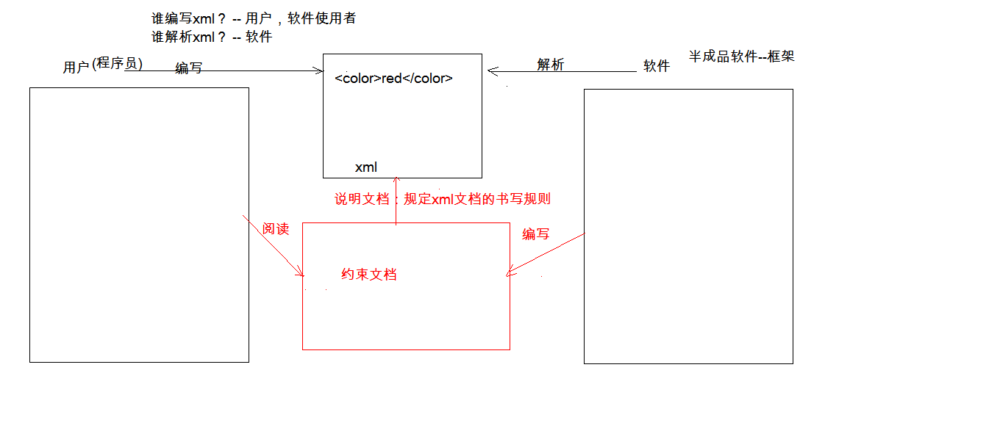
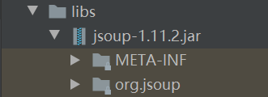

# 导航

1. [XML概念](#XML概念)
2. [XML的语法](#XML的语法)
3. [XML的约束与解析](#XML的约束与解析)

---

#  XML概念

`Extensible Markup Language` 可扩展标记语言。

##  发展历史

先出现的是`HTML`（语言松散），后出现的是`XML`（语法严格）。`HTML`太松散，不严谨，以至于`W3C`想放弃该语言，推出了语法严格的`XML`，替换`HTML`做为页面的展示，但失败了，后作为标记语言使用。

> `XML`和`HTML`都是`w3c`（万维网联盟）创建的。

### 配置文件(`properties`)

之前使用的是配置文件`properties`。

缺点：无结构化，不方便阅读。

```properties
username=zhangsan
age=23
gender=nan

username=lisi
age=24
gender=nv
```


### 标记语言(`XML`)

现在使用更好的标记语言`XML`。

**优点：**

* 结构化，方便阅读；
* 可扩展：标签都是自定义的。 `<user>  <student>`

```xml
<user id='1'>
	<name>zhangsan</name>
	<age>23</age>
	<gender>male</gender>
</user>

<user id='2'>
	<name>lisi</name>
	<age>24</age>
	<gender>female</gender>
</user>
```

## XML功能

存储数据。

	1. 配置文件；
	2. 在网络中传输。

## xml与html的区别

  1. `xml`标签都是自定义的，`html`标签是预定义；
  2. `xml`的语法严格，`html`语法松散；
  3. `xml`是存储数据的，`html`是展示数据。

# XML的语法

## 快速入门

### 建立一个user.xml文档

```xml
<?xml version='1.0' ?>
<users>
	<user id='1'>
		<name>zhangsan</name>
		<age>23</age>
		<gender>male</gender>
		<br/>
	</user>

    <user id='2'>
        <name>lisi</name>
        <age>24</age>
        <gender>female</gender>
    </user>

</users>
```

### 怎么判断xml文档是否有错？

直接把.xml文档拖到浏览器，不报错就证明没错误。


## ★基本语法

1. `xml`文档的后缀名 `.xml`；(`a.xml`)
2. `xm`l第一行必须定义为文档声明；(`<?xml version='1.0' ?>`)
3. `xml`文档中有且仅有一个根标签；(`<users>   </users>`)
4. 属性值必须使用引号(单双都可)引起来；(`id='1'`)
5. 标签必须正确关闭；(`<user id='1'>  </user>`)
6. `xml`标签名称区分大小写。

## 组成部分

1. 文档声明
2. 指令
3. 标签
4. 属性
5. 文本

### 文档声明

`<?xml version='1.0' ?>`

1. 格式

   `<?xml 属性列表 ?>`

2. 属性列表：
  * `version`：版本号，必须的属性；

  * `encoding`：编码方式。告知解析引擎当前文档使用的字符集，默认值：`ISO-8859-1`；(`<?xml version='1.0' encoding='utf-8' ?>`)

  * `standalone`：是否独立

         	* 取值：
           
           * `yes`：不依赖其他文件
           * `no`：依赖其他文件

### 指令(了解)

   结合`css`使用。
```xml
<?xml version='1.0' ?>
<?xml-stylesheet type="text/css" href="a.css" ?><!---该句为指令 -->
<!---user.xml 文件 -->
<users>
	<user id='1'>
		<name>zhangsan</name>
		<age>23</age>
		<gender>male</gender>
		<br/>
	</user>
    
<user id='2'>
	<name>lisi</name>
	<age>24</age>
	<gender>female</gender>
</user>

</users> 
```

​	

```css
/* a.css 文件*/
name{
	color:red;
}
```

### 标签

标签名称是自定义的。（`<user>  <student>`)

1. 规则
	* 名称可以包含字母、数字以及其他的字符 
	* 名称不能以数字或者标点符号开始 
	* 名称不能以字母` xml`（或者 `XML`、`Xml `等等）开始 
	* 名称不能包含空格 

### 属性

`id`属性值唯一，不能重复。

### 文本

`CDATA`区：在该区域中的数据会被原样展示

格式： ` <![CDATA[ 数据 ]]>`

```xml
<code>
    <![CDATA[ 
        if(a < b && a > c){}
    ]]>
</code>
```

# XML的约束与解析

## 约束
概念：规定`xml`文档的书写规则，由软件   使用者（程序员）编写，软件进行解析。



作为框架的使用者(程序员)：
 	1. 能够在`xml`中引入约束文档
 	2. 能够简单的读懂约束文档	

* 分类：
	1. `DTD`:一种简单的约束技术；
	2. `Schema`:一种复杂的约束技术。
### DTD

```dtd
<!ELEMENT students (student+) ><!--- 定义一个 students 标签，这个标签体内能出现 0 个或多个 student 标签-->
<!ELEMENT student (name,age,sex)><!--- 定义一个 student 标签，这个标签体内能出现 name age sex 三个标签，并且必须每个只能出现一次，且按顺序出现-->
<!ELEMENT name (#PCDATA)><!--- 定义一个 name 标签，存放 字符串-->
<!ELEMENT age (#PCDATA)><!--- 定义一个 age 标签，存放 字符串-->
<!ELEMENT sex (#PCDATA)><!--- 定义一个 sex 标签，存放 字符串-->
<!ATTLIST student number ID #REQUIRED><!--- 定义 student 标签 必须存在 ID 属性，存放值唯一 -->

 <!---
    ELEMENT 定义标签
    ATTLIST 定义属性
    PCDATA 存放字符串
 -->

<!--- student.dtd 约束文件 -->
```

使用步骤：

 1. 引入`dtd`文档到`xml`文档中

     - 内部`dtd`：将约束规则定义在`xml`文档中

       ```xml
       <?xml version="1.0" encoding="UTF-8" ?>
       <!--- 引用内部 dtd -->
       <!DOCTYPE students [
       
       		<!ELEMENT students (student+) >
       		<!ELEMENT student (name,age,sex)>
       		<!ELEMENT name (#PCDATA)>
       		<!ELEMENT age (#PCDATA)>
       		<!ELEMENT sex (#PCDATA)>
       		<!ATTLIST student number ID #REQUIRED>
       		]>
       <students>
       	
       	<student number="s001">
       		<name>zhangsan</name>
       		<age>abc</age>
       		<sex>hehe</sex>
       	</student>
       
       	<student number="s002">
       		<name>lisi</name>
       		<age>24</age>
       		<sex>female</sex>
       	</student>
       	
       </students>
       ```

     - 外部`dtd`：将约束的规则定义在外部的`dtd`文件中

        - 本地：`<!DOCTYPE 根标签名 SYSTEM "dtd文件的位置">`

          ```xml
          <?xml version="1.0" encoding="UTF-8" ?>
          <!DOCTYPE students SYSTEM "student.dtd"><!--- 引用外部的本地 dtd -->
          
          <students>
          	
          	<student number="s001">
          		<name>zhangsan</name>
          		<age>abc</age>
          		<sex>hehe</sex>
          	</student>
          
          	<student number="s002">
          		<name>lisi</name>
          		<age>24</age>
          		<sex>female</sex>
          	</student>
          	
          </students>
          ```

        -  网络：`<!DOCTYPE 根标签名 PUBLIC "dtd文件名字" "dtd文件的位置URL">`

### Schema 

`dtd`可以规定标签位置，标签的顺序和次数，但不能规定标签体的内容(比如性别应该是`nan nv` ，但也可以输入`hehe` 这种)。 

`Schema `可以规定标签体的内容。

例：约束文件

```xml
<!-- 文件 student.xsd ，使用时需删除此行-->
<?xml version="1.0"?>
<xsd:schema xmlns="http://www.itcast.cn/xml"
        xmlns:xsd="http://www.w3.org/2001/XMLSchema"
        targetNamespace="http://www.itcast.cn/xml" elementFormDefault="qualified">
    <!-- 定义了一个元素 students ，students 的类型是 studentsType-->
    <xsd:element name="students" type="studentsType"/>
    <!-- 声明了一个复杂的自定义类型 studentsType -->
    <xsd:complexType name="studentsType">
        <!-- sequence 表示按顺序出现 student 元素，student 的类型是 studentType，最少出现 0 次，最多出现 无限制-->
        <xsd:sequence>
            <xsd:element name="student" type="studentType" minOccurs="0" maxOccurs="unbounded"/>
        </xsd:sequence>
    </xsd:complexType>
    <!-- 声明了一个复杂的自定义类型 studentType -->
    <xsd:complexType name="studentType">
        <!-- sequence 表示按顺序出现 name age sex 元素，name 的类型是字符串，age 的类型是 ageType，sex 的类型是 sexType -->
        <xsd:sequence>
            <xsd:element name="name" type="xsd:string"/>
            <xsd:element name="age" type="ageType" />
            <xsd:element name="sex" type="sexType" />
        </xsd:sequence>
        <!-- 定义了一个属性 number，number 的类型为 numberType，该元素必须存在-->
        <xsd:attribute name="number" type="numberType" use="required"/>
    </xsd:complexType>
    <!-- 声明了一个简单的自定义类型 sexType -->
    <xsd:simpleType name="sexType">
        <!-- sexType 的类型是字符串，只能为枚举类型 male female -->
        <xsd:restriction base="xsd:string">
            <xsd:enumeration value="male"/>
            <xsd:enumeration value="female"/>
        </xsd:restriction>
    </xsd:simpleType>
    <!-- 声明了一个简单的自定义类型 ageType -->
    <xsd:simpleType name="ageType">
        <!-- ageType 的类型是数字，最小值为 0 ，最大值为 256 -->
        <xsd:restriction base="xsd:integer">
            <xsd:minInclusive value="0"/>
            <xsd:maxInclusive value="256"/>
        </xsd:restriction>
    </xsd:simpleType>
    <!-- 声明了一个简单的自定义类型 numberType -->
    <xsd:simpleType name="numberType">
        <!-- numberType 的类型是字符串，值为一个正则表达式 heima_\d{4} -->
        <xsd:restriction base="xsd:string">
            <xsd:pattern value="heima_\d{4}"/>
        </xsd:restriction>
    </xsd:simpleType>
</xsd:schema>
```

使用

```xml
<!-- 文件 student.xml ，使用时需删除此行-->
<?xml version="1.0" encoding="UTF-8" ?>
<!-- 引用文件 student.xsd -->
<students   xmlns:xsi="http://www.w3.org/2001/XMLSchema-instance"
			xmlns="http://www.itcast.cn/xml"
			xsi:schemaLocation="http://www.itcast.cn/xml  student.xsd"
>
	<student number="heima_0001">
		<name>tom</name>
		<age>18</age>
		<sex>male</sex>
	</student>

</students>
```

引用流程：
 1. 填写`xml`文档的根元素； (`students`)

 2. 引入`xsi`前缀，固定格式；(`xmlns:xsi="http://www.w3.org/2001/XMLSchema-instance"`) 

 3. 通过`xsi`前缀引入`xsd`文件的路径，给该路径下的文件起了个命名空间`http://www.itcast.cn/xml`，以后使用该文件下的元素需要加上前缀命名空间；(`xsi:schemaLocation="http://www.itcast.cn/xml  student.xsd"`)

 4. 为简化书写，为每一个`xsd`约束声明一个前缀，作为标识，什么都不写表示空前缀。  `xmlns="http://www.itcast.cn/xml" `

     - 如使用 `xmlns:a="http://www.itcast.cn/xml"`，那么再使用元素时都需要加上前缀`a`，不同的前缀方便引用多个`xsi`文件时进行区分。

       ```xml
       <!-- 文件 student.xml ，使用时需删除此行-->
       <?xml version="1.0" encoding="UTF-8" ?>
       <!-- 引用文件 student.xsd -->
       <a:students   xmlns:xsi="http://www.w3.org/2001/XMLSchema-instance"
       			xmlns="http://www.itcast.cn/xml"
       			xsi:schemaLocation="http://www.itcast.cn/xml  student.xsd"
       >
       	<a:student number="heima_0001">
       		<a:name>tom</a:name>
       		<a:age>18</a:age>
       		<a:sex>male</a:sex>
       	</a:student>
       
       </a:students>
       ```

实例：`MVC`框架的`xml`约束文档的使用

```xml
<?xml version="1.0" encoding="UTF-8"?>
<!-- 
  1. 填写 xml 文档的根元素； (beans)

  2. 引入 xsi 前缀，固定格式；(`xmlns:xsi="http://www.w3.org/2001/XMLSchema-instance"`) 

  3. 通过 xsi 前缀引入 xsd 文件的路径，并给该路径下的文件起个 命名空间。
  	 （1）引用的第 1 份约束文档 ...spring-beans.xsd ,命名空间为 ...beans ；
  	 （2）引用的第 2 份约束文档 ...spring-context.xsd ,命名空间为 ...context ;
  	 （3）引用的第 3 份约束文档 ...spring-mvc.xsd ,命名空间为 ...mvc 。
  4. 为简化书写，为每一个 xsd 约束声明一个前缀，作为标识，什么都不写表示空前缀。
   	 （1）引用的第 1 份约束文档的前缀为 空前缀 ；
  	 （2）引用的第 2 份约束文档的前缀为 context ；
  	 （3）引用的第 3 份约束文档的前缀为 mvc 。

  5. 使用
   	 （1）引用的第 1 份约束文档，直接不加前缀使用，如<beans></beans> ；
  	 （2）引用的第 2 份约束文档，加前缀 context: 使用，如<context:annotation-config />；
  	 （3）引用的第 3 份约束文档，加前缀 mvc: 使用，如<mvc:annotation-driven /> 。
	 -->
<beans xmlns="http://www.springframework.org/schema/beans"
    xmlns:xsi="http://www.w3.org/2001/XMLSchema-instance" 
	xmlns:context="http://www.springframework.org/schema/context"
    xmlns:mvc="http://www.springframework.org/schema/mvc"
    xsi:schemaLocation="
        http://www.springframework.org/schema/beans
        http://www.springframework.org/schema/beans/spring-beans.xsd
        http://www.springframework.org/schema/context 
        http://www.springframework.org/schema/context/spring-context.xsd
        http://www.springframework.org/schema/mvc
        http://www.springframework.org/schema/mvc/spring-mvc.xsd">
    <context:component-scan base-package="cn.cisol.mvcdemo">
        <context:include-filter type="annotation"
            expression="org.springframework.stereotype.Controller" />
    </context:component-scan>
    
    <mvc:resources mapping="/resources/**" location="/resources/" />

    <bean id="multipartResolver"
        class="org.springframework.web.multipart.commons.CommonsMultipartResolver">
        <property name="maxUploadSize" value="209715200" />
        <property name="defaultEncoding" value="UTF-8" />
        <property name="resolveLazily" value="true" />
    </bean>
</beans>
		<!-- 注：该文档删除了部分不需要的内容-->
```

## 解析

概念：操作`xml`文档，将文档中的数据读取到内存中
### 操作`xml`文档

1. 解析(读取)：将文档中的数据读取到内存中
2. 写入：将内存中的数据保存到`xml`文档中。持久化的存储

### 解析`xml`的方式：

1. `DOM`：将标记语言文档一次性加载进内存，在内存中形成一颗`dom`树，一般用于服务器端。
	* 优点：操作方便，可以对文档进行`CRUD`的所有操作。
	* 缺点：占内存,一次加载所有内容进内存。
2. `SAX`：逐行读取（读一行释放一行），基于事件驱动的，难度比较大，一般用于移动端。 
	* 优点：不占内存，内存中每次只用一行。
	* 缺点：只能读取，不能增删改。

### xml常见的解析器：

  		1. `JAXP`：`sun`公司提供的解析器，支持`dom`和`sax`两种思想，基本没有人使用；
  		2. `DOM4J`：一款非常优秀的解析器，基于`dom`思想。
  		3. `Jsoup`：`jsoup `是一款`Java `的`HTML`解析器，可直接解析某个`URL`地址、`HTML`文本内容。它提供了一套非常省力的`API`，可通过`DOM`，`CSS`以及类似于`jQuery`的操作方法来取出和操作数据（需要学习的）。
  		4.  `PULL`：`Android`操作系统内置的解析器，`sax`方式的。

### Jsoup解析器

概念：`jsoup` 是一款`Java `的`HTML`解析器，可直接解析某个`URL`地址、`HTML`文本内容。它提供了一套非常省力的`API`，可 通过`DOM`，`CSS`以及类似于`jQuery`的操作方法来取出和操作数据。

#### 快速入门：

1. 导入`jar`包；(`jsoup-1.11.2.jar`)

   

2. 获取`Document`对象；

3. 获取对应的标签`Element`对象；

4. 获取数据。

   ```xml
   <!-- student.xml -->
   <?xml version="1.0" encoding="UTF-8" ?>
   
   <students>
   	<student number="heima_0001">
   		<name id="itcast">
   			<xing>张</xing>
   			<ming>三</ming>
   		</name>
   		<age>18</age>
   		<sex>male</sex>
   	</student>
   	<student number="heima_0002">
   		<name>jack</name>
   		<age>18</age>
   		<sex>female</sex>
   	</student>
   
   </students>
   ```

   ```java
   //JsoupDemo1 文件
   package cn.itcast.xml.jsoup;
   
   /**
    * Jsoup快速入门
    */
   public class JsoupDemo1 {
       public static void main(String[] args) throws IOException {
           //2.获取Document对象，根据xml文档获取
           //2.1获取student.xml的path
           String path = JsoupDemo1.class.getClassLoader().getResource("student.xml").getPath();
           //2.2解析xml文档，加载文档进内存，获取dom树--->Document
           Document document = Jsoup.parse(new File(path), "utf-8");
           //3.获取元素对象 Element
           Elements elements = document.getElementsByTag("name");
   
           System.out.println(elements.size());//2
           //3.1获取第一个name的Element对象
           Element element = elements.get(0);
           //3.2获取数据
           String name = element.text();
           System.out.println(name);//tom
       }
   
   }
   
   ```

   

#### 对象的使用

1. `Jsoup`：工具类，可以解析`html`或`xml`文档，返回`Document`
	
	* `parse`：解析`html`或`xml`文档，返回`Document`
		
		* `parse​(File in, String charsetName)`：解析`xml`或`html`文件的。
		* `parse​(String html)`：解析`xml`或`html`字符串
		* `parse​(URL url, int timeoutMillis)`：通过网络路径获取指定的`htm`l或`xml`的文档对象
		
	* 代码
	
	  ```Java
	  //需要使用JsoupDemo2.java文件、student.xml文件
	  package cn.itcast.xml.jsoup;
	  
	  
	  /**
	   * Jsoup对象功能
	   */
	  public class JsoupDemo2 {
	      public static void main(String[] args) throws IOException {
	          //2.1获取student.xml的path
	          String path = JsoupDemo2.class.getClassLoader().getResource("student.xml").getPath();
	          //2.2解析xml文档，加载文档进内存，获取dom树--->Document
	         /* Document document = Jsoup.parse(new File(path), "utf-8");
	          System.out.println(document);*/
	  
	         //2.parse(String html)：解析xml或html字符串
	         /* String str = "<?xml version=\"1.0\" encoding=\"UTF-8\" ?>\n" +
	                  "\n" +
	                  "<students>\n" +
	                  "\t<student number=\"heima_0001\">\n" +
	                  "\t\t<name>tom</name>\n" +
	                  "\t\t<age>18</age>\n" +
	                  "\t\t<sex>male</sex>\n" +
	                  "\t</student>\n" +
	                  "\t<student number=\"heima_0002\">\n" +
	                  "\t\t<name>jack</name>\n" +
	                  "\t\t<age>18</age>\n" +
	                  "\t\t<sex>female</sex>\n" +
	                  "\t</student>\n" +
	                  "\n" +
	                  "</students>";
	          Document document = Jsoup.parse(str);
	          System.out.println(document);*/
	  
	         //3.parse(URL url, int timeoutMillis)：通过网络路径获取指定的html或xml的文档对象,timeoutMillis表示一个超时时间
	          URL url = new URL("https://baike.baidu.com/item/jsoup/9012509?fr=aladdin");//代表网络中的一个资源路径
	          Document document = Jsoup.parse(url, 10000);
	          System.out.println(document);
	  
	      }
	  
	  }
	  /*
	  解析出来的内容
	  <students>
	  	<student number="heima_0001">
	  		<name id="itcast">
	  			<xing>张</xing>
	  			<ming>三</ming>
	  		</name>
	  		<age>18</age>
	  		<sex>male</sex>
	  	</student>
	  	<student number="heima_0002">
	  		<name>jack</name>
	  		<age>18</age>
	  		<sex>female</sex>
	  	</student>
	  
	  </students>
	  */
	  
	  ```
	
	  
	
2. `Document`：文档对象。代表内存中的`dom`树
	
	* 获取`Element`对象
		* `getElementById​(String id)`：根据`id`属性值获取唯一的`element`对象
		* `getElementsByTag​(String tagName)`：根据标签名称获取元素对象集合
		* `getElementsByAttribute​(String key)`：根据属性名称获取元素对象集合
		* `getElementsByAttributeValue​(String key, String value)`：根据对应的属性名和属性值获取元素对象集合
		
	* 代码
	
	  ```java
	  //需要使用JsoupDemo3.java文件、student.xml文件
	  package cn.itcast.xml.jsoup;
	  
	  /**
	   * Document/Element对象功能
	   */
	  public class JsoupDemo3 {
	      public static void main(String[] args) throws IOException {
	          //1.获取student.xml的path
	          String path = JsoupDemo3.class.getClassLoader().getResource("student.xml").getPath();
	          //2.获取Document对象
	          Document document = Jsoup.parse(new File(path), "utf-8");
	  
	          //3.获取元素对象了。
	          //3.1获取所有student对象
	          Elements elements = document.getElementsByTag("student");
	          System.out.println(elements);
	          /*
	          <student number="heima_0001">
	              <name id="itcast">
	                  <xing>张</xing>
	                  <ming>三</ming>
	              </name>
	              <age>18</age>
	              <sex>male</sex>
	  	    </student>
	  	    <student number="heima_0002">
	              <name>jack</name>
	              <age>18</age>
	              <sex>female</sex>
	  	    </student>
	          */
	  
	          System.out.println("-----------");
	  
	  
	          //3.2 获取属性名为id的元素对象们
	          Elements elements1 = document.getElementsByAttribute("id");
	          System.out.println(elements1);
	          /*
	          <name id="itcast">
	  			<xing>张</xing>
	  			<ming>三</ming>
	  		</name>
	           */
	          System.out.println("-----------");
	          //3.2获取 number属性值为heima_0001的元素对象
	          Elements elements2 = document.getElementsByAttributeValue("number", "heima_0001");
	          System.out.println(elements2);
	          /*
	          <student number="heima_0001">
	              <name id="itcast">
	                  <xing>张</xing>
	                  <ming>三</ming>
	              </name>
	              <age>18</age>
	              <sex>male</sex>
	  	    </student>
	           */
	          System.out.println("-----------");
	          //3.3获取id属性值的元素对象
	          Element itcast = document.getElementById("itcast");
	          System.out.println(itcast);
	          /*
	          <name id="itcast">
	  			<xing>张</xing>
	  			<ming>三</ming>
	  		</name>
	           */
	      }
	  
	  }
	  ```
	
	  
	
3. `Elements`：元素`Element`对象的集合。可以当做` ArrayList<Element>`来使用

4. `Element`：元素对象
	
	1. 获取子元素对象
		* `getElementById​(String id)`：根据`id`属性值获取唯一的`element`对象
		* `getElementsByTag​(String tagName)`：根据标签名称获取元素对象集合
		* `getElementsByAttribute​(String key)`：根据属性名称获取元素对象集合
	* `getElementsByAttributeValue​(String key, String value)`：根据对应的属性名和属性值获取元素对象集合
	
	2. 获取属性值
		
		* `String attr(String key)`：根据属性名称获取属性值
		
	3. 获取文本内容
		- `String text()`:获取文本内容
		- `String html()`:获取标签体的所有内容(包括字标签的字符串内容)
		
	4. 代码
	
	   ```Java
	   //需要使用JsoupDemo4.java文件、student.xml文件
	   package cn.itcast.xml.jsoup;
	   
	   /**
	    *Element对象功能
	    */
	   public class JsoupDemo4 {
	       public static void main(String[] args) throws IOException {
	           //1.获取student.xml的path
	           String path = JsoupDemo4.class.getClassLoader().getResource("student.xml").getPath();
	           //2.获取Document对象
	           Document document = Jsoup.parse(new File(path), "utf-8");
	           /*
	           Element：元素对象
	   				1. 获取子元素对象
	   					* getElementById(String id)：根据id属性值获取唯一的element对象
	   					* getElementsByTag(String tagName)：根据标签名称获取元素对象集合
	   					* getElementsByAttribute(String key)：根据属性名称获取元素对象集合
	   					* getElementsByAttributeValue(String key, String value)：根据对应的属性名和属性值获取元素对象集合
	   
	   				2. 获取属性值
	   					* String attr(String key)：根据属性名称获取属性值
	   				3. 获取文本内容
	   					* String text():获取所有字标签的纯文本内容
	   					* String html():获取标签体的所有内容(包括子标签的标签和文本内容)
	            */
	           //通过Document对象获取name标签，获取所有的name标签，可以获取到两个
	           Elements elements = document.getElementsByTag("name");
	           System.out.println(elements.size());//2
	           System.out.println("----------------");
	           //通过Element对象获取子标签对象
	           Element element_student = document.getElementsByTag("student").get(0);
	           Elements ele_name = element_student.getElementsByTag("name");
	           System.out.println(ele_name.size());//1
	   
	           //获取student对象的属性值
	           String number = element_student.attr("NUMBER");
	           System.out.println(number);//heima_0001
	           System.out.println("------------");
	           //获取文本内容
	           String text = ele_name.text();
	           String html = ele_name.html();
	           
	           System.out.println(text);//tom  张 三
	           System.out.println(html);
	           /*
	               tom  <xing>张</xing>
	               <ming>三</ming>
	           */
	       }
	   }
	   ```
	
	   
	
5. `Node`：节点对象

  是Document和Element的父类。(理解)	

#### 快捷查询方式

##### 选择器(selector)

  - 使用的方法：`Elements	select​(String cssQuery)`

  - 语法：参考`Selector`类中定义的语法

  - 代码

    ```java
    //需要使用JsoupDemo5.java文件、student.xml文件
    package cn.itcast.xml.jsoup;
    
    /**
     *选择器查询
     */
    public class JsoupDemo5 {
        public static void main(String[] args) throws IOException {
            //1.获取student.xml的path
            String path = JsoupDemo5.class.getClassLoader().getResource("student.xml").getPath();
            //2.获取Document对象
            Document document = Jsoup.parse(new File(path), "utf-8");
    
            //3.查询name标签
            /*
                div{
    
                }
             */
            Elements elements = document.select("name");
            System.out.println(elements);
            /*
            <name id="itcast">
    			<xing>张</xing>
    			<ming>三</ming>
    		</name>
    		<name>jack</name>
             */
            System.out.println("=----------------");
            //4.查询id值为itcast的元素
            Elements elements1 = document.select("#itcast");
            System.out.println(elements1);
            /*
            <name id="itcast">
    			<xing>张</xing>
    			<ming>三</ming>
    		</name>
             */
            System.out.println("----------------");
            //5.获取student标签并且number属性值为heima_0001的age子标签
            //5.1.获取student标签并且number属性值为heima_0001
            Elements elements2 = document.select("student[number=\"heima_0001\"]");
            System.out.println(elements2);
            /*
            <student number="heima_0001">
                <name id="itcast">
                    <xing>张</xing>
                    <ming>三</ming>
                </name>
                <age>18</age>
                <sex>male</sex>
    	    </student>
             */
            System.out.println("----------------");
    
            //5.2获取student标签并且number属性值为heima_0001的age子标签
            Elements elements3 = document.select("student[number=\"heima_0001\"] > age");
            System.out.println(elements3);// <age>18</age>
        }
    }
    ```

    

##### XPath

概念：`XPath`即为`XML`路径语言，它是一种用来确定`XML`（标准通用标记语言的子集）文档中某部分位置的语言

使用：

1. 使用`Jsoup`的`Xpath`需要额外导入`jar`包；(`JsoupXpath-0.3.2.jar`)
2. 查询`w3cshool`参考手册，使用`xpath`的语法完成查询。

代码：

```java
//需要使用JsoupDemo6.java文件、student.xml文件
package cn.itcast.xml.jsoup;


/**
 *XPath查询
 */
public class JsoupDemo6 {
    public static void main(String[] args) throws IOException, XpathSyntaxErrorException {
        //1.获取student.xml的path
        String path = JsoupDemo6.class.getClassLoader().getResource("student.xml").getPath();
        //2.获取Document对象
        Document document = Jsoup.parse(new File(path), "utf-8");

        //3.根据document对象，创建JXDocument对象
        JXDocument jxDocument = new JXDocument(document);

        //4.结合xpath语法查询
        //4.1查询所有student标签
        List<JXNode> jxNodes = jxDocument.selN("//student");
        for (JXNode jxNode : jxNodes) {
            System.out.println(jxNode);
        }

        System.out.println("--------------------");

        //4.2查询所有student标签下的name标签
        List<JXNode> jxNodes2 = jxDocument.selN("//student/name");
        for (JXNode jxNode : jxNodes2) {
            System.out.println(jxNode);
        }

        System.out.println("--------------------");

        //4.3查询student标签下带有id属性的name标签
        List<JXNode> jxNodes3 = jxDocument.selN("//student/name[@id]");
        for (JXNode jxNode : jxNodes3) {
            System.out.println(jxNode);
        }
        System.out.println("--------------------");
        //4.4查询student标签下带有id属性的name标签 并且id属性值为itcast

        List<JXNode> jxNodes4 = jxDocument.selN("//student/name[@id='itcast']");
        for (JXNode jxNode : jxNodes4) {
            System.out.println(jxNode);
        }
    }
}
```

